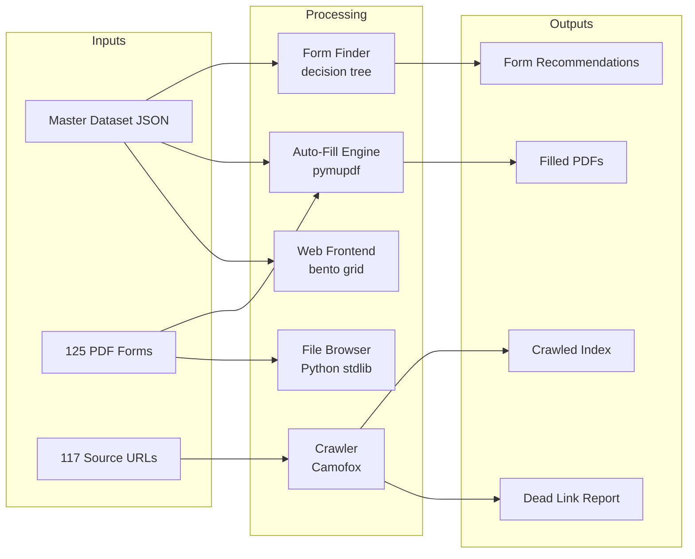

# Legal Clear — Florida Pro Se Court Form Assistant

AI-powered tools for self-represented litigants in Florida. Helps people who can't afford an attorney find, understand, and fill out the right court forms.

Covers all 20 judicial circuits and 67 counties.

[See main README](../README.md) for the full project overview, structure, quick start, and case types.

---

## Architecture

### Components

| Component | Entry point | Status |
|-----------|-------------|--------|
| Form Finder | `scripts/form_finder.py` | Complete — 13 case types, interactive decision tree |
| Auto-Fill Engine | `scripts/auto_fill.py` | Partial — 5 of 13 case types wired |
| Web Frontend | `index.html` | Complete — dark-mode bento grid |
| File Browser | `fileserver.py` (:8099) | Complete — markdown rendering, PDF preview |
| Crawler | `scripts/fl_forms_crawler.py` | Complete — requires Camofox |
| Quartz Wiki | nginx :8100 | Complete — Obsidian-compatible static site |

### Inputs

- `raw/articles/florida-court-forms-dataset.json` — master dataset (13 case types, 20 circuits, 67 counties)
- `raw/forms/` — 125 downloaded PDFs (98MB)
- `raw/forms/full_catalog.json` — 71 forms indexed
- `raw/forms/form_fields.json` — extracted AcroForm fields (10 forms)
- `scripts/sources.json` — 117 crawler entry-point URLs

### Outputs

- Filled PDF forms in `/tmp/legal_clear_YYYYMMDD_HHMMSS/`
- Form recommendation text (stdout)
- Crawler index: `fl_forms_index_crawled.json`
- Dead link report: `dead_links_report.csv`

### Dependencies

Python: `pymupdf`, `pdfplumber`, `httpx`
External: Camofox (for crawler), nginx (for web serving), Quartz (for wiki)

### Data Flow

---

## Phase Completion Status

| Phase | Description | Status | Notes |
|-------|-------------|--------|-------|
| 1 | Smart Directory | ✓ Complete | Dataset, wiki, 125 PDFs |
| 2 | AI Form Finder | ✓ Complete | Decision tree, form explanations, Hermes skill |
| 3 | Auto-Fill Engine | ✓ Complete | `auto_fill.py` — interviews for all 13 case types, PDF fill for 6 |
| 3 | Crawler | ✓ Complete | Camofox-based, 3-phase pipeline |
| 3 | Web Frontend | ✓ Complete | Dark-mode bento grid, county lookup |
| 3 | File Browser | ✓ Complete | PDF preview, markdown rendering |
| 3 | Quartz Wiki | ✓ Complete | Obsidian-compatible static site |

### Unfinished Work

- **County-specific forms**: 7 of 13 case types use county-specific forms not in our PDF catalog (eviction, small claims, probate, guardianship, expungement). The auto-fill now provides informational interviews with next-step guidance for these.
- **Field mapping**: ~50% of extracted form fields have automated interview-to-field mappings. Financial forms (12.902b/c) have many unmapped fields that need per-field interview questions.
- **No test suite**: Zero automated tests.
- **No CI/CD**: No GitHub Actions or deployment automation.
- **Missing circuit forms**: Only Circuits 5, 11, 19 have downloaded local forms; 17 circuits have none.

---

## Provenance

| Field | Value |
|-------|-------|
| Hermes Run ID | discovery |
| Payload Hash | 186c30fcf1183f4f7aaa92311f9119e59af567cc28646505c69ddcee841f4ee1 |
| Source Path | /home/hermes/workspace/legal-clear |
| Published At | 2026-07-27T09:01:22Z |
| Kind | project |
| Destination | existing_repo |
